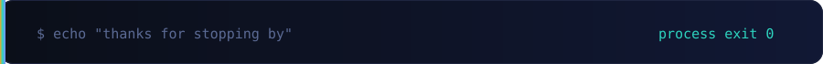

<div align="center">


<br/>

<a href="https://readme-typing-svg.demolab.com">
  
</a>

<br/><br/>

[](https://www.linkedin.com/in/kaushal-jha-6073042aa/)
[](https://github.com/KausHalJHa-04)
[](https://www.instagram.com/_kaushal_jha04/)
[](mailto:jhakaushal361@gmail.com)
[](https://wa.me/qr/TTL44FU4A7DTP1)

<!-- Swap this URL for your live portfolio link once it's deployed -->
[](https://kaushal.kesug.com)

  

</div>

<br/>

## `01` &nbsp; About Me

I'm a **Full Stack Developer** based in India who enjoys turning complex problems into clean, functional web applications — front to back. I work primarily with the **MERN stack**, and I've spent time across five internships shipping real production features for actual clients and research teams.

```yaml
role:        Full Stack Web Developer (MERN)
based_in:    New Delhi, India
experience:  4+ internships · 6 shipped projects
currently:   Sharpening Next.js & TypeScript, exploring Generative AI
open_to:     Internships, freelance work, collaboration & tech discussions
contact:     jhakaushal361@gmail.com
```

<br/>

## `02` &nbsp; Tech Stack

<table>
<tr>
<td valign="top" width="50%">

**Languages**


**Frontend**


</td>
<td valign="top" width="50%">

**Backend & Database**


<br/>


**Tools, Hosting & Design**


<br/>


</td>
</tr>
</table>

<br/>

## `03` &nbsp; Experience

<table>
<tr>
<td width="150" valign="top"><sub><strong>Jul 2026 – Aug 2026</strong></sub></td>
<td>
<strong>Web Development Intern</strong> · DiziCode Infotech <sub>(Full-time · Dadri, UP)</sub><br/>
Contributed to development and responsive UI across five client sites — A2A Smart Solution, Vishudhii, Navya Nexus AI, ACE Hospitality LLC, and Onetara Realty.
</td>
</tr>
<tr>
<td valign="top"><sub><strong>Apr 2026 – Jun 2026</strong></sub></td>
<td>
<strong>Research Intern</strong> · DRDO, SSPL <sub>(Delhi)</sub><br/>
8-week research internship — real-world problem solving, project documentation and reporting under mentor guidance.
</td>
</tr>
<tr>
<td valign="top"><sub><strong>Jan 2026 – Apr 2026</strong></sub></td>
<td>
<strong>Frontend Developer Intern</strong> · FusionHive Business Solution <sub>(BimaScore by Alps Insurance)</sub><br/>
Built responsive interfaces from UI/UX designs, focused on cross-browser compatibility and modern frontend practices.
</td>
</tr>
<tr>
<td valign="top"><sub><strong>Jul 2025 – Sep 2025</strong></sub></td>
<td>
<strong>Full Stack Development Intern</strong> · UptoSkills <sub>(Remote)</sub><br/>
Built an AI-powered Resume Builder & Analyzer (MERN + Gemini API) with JWT-secured REST APIs, deployed via Docker.
</td>
</tr>
<tr>
<td valign="top"><sub><strong>Jan 2025 – Apr 2025</strong></sub></td>
<td>
<strong>Web Development Intern</strong> · MS Enterprises <sub>(Hybrid)</sub><br/>
Built e-commerce product catalogs, carts and checkout flows with Node/Express REST APIs and MongoDB.
</td>
</tr>
</table>

<br/>

## `04` &nbsp; Featured Projects

| Project | Description | Links |
|---|---|---|
| 🎟️ **Eventora** | Full-stack MERN event management platform — discovery, secure bookings & admin-controlled operations | [Live](https://eventora-ruby.vercel.app) · [Source](https://github.com/KausHalJHa-04/EVENTORA) |
| 🔗 **URL Shortener** | Production-ready MERN URL shortener with QR code generation and a clean, responsive UI | [Live](https://url-shortener-app-lemon.vercel.app) · [Source](https://github.com/KausHalJHa-04/URL-Shortener-App) |
| 🍏 **Apple Landing Page** | Pixel-detail clone of Apple's product landing page with smooth animations | [Live](https://apple-landing-page-chi.vercel.app) · [Source](https://github.com/KausHalJHa-04/APPLE_Landing-page) |
| 📄 **Resume Analyzer** | AI-powered resume analysis and smart suggestions using the Gemini API | [Live](https://resume-analyzer-wine-six.vercel.app) · [Source](https://github.com/KausHalJHa-04/Resume_Analyzer) |
| 💻 **Code Review Platform** | A collaborative platform for sharing and reviewing code snippets | [Live](https://code-review-site.vercel.app) · [Source](https://github.com/KausHalJHa-04/CODE-REVIEW) |
| 🖼️ **AI Image Enhancer** | Upscales and enhances image quality using AI-driven processing | [Live](https://ai-image-enhancer-tawny-two.vercel.app) · [Source](https://github.com/KausHalJHa-04/IMAGE_ENHANCER) |

<br/>

## `05` &nbsp; GitHub Analytics

<div align="center">


<br/><br/>

<table>
<tr>
<td align="center" width="140"><strong>4+</strong><br/><sub>Internships</sub></td>
<td align="center" width="140"><strong>6</strong><br/><sub>Shipped Projects</sub></td>
<td align="center" width="140"><strong>10+</strong><br/><sub>Technologies</sub></td>
</tr>
</table>

</div>

<br/>

## `06` &nbsp; Let's Connect

<div align="center">

I'm always open to interesting conversations and opportunities — internships, freelance work, or just talking tech. Reach out, I usually reply quickly.

<a href="mailto:jhakaushal361@gmail.com"></a>

</div>

<br/>

<div align="center">

</div>
